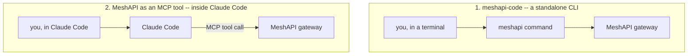
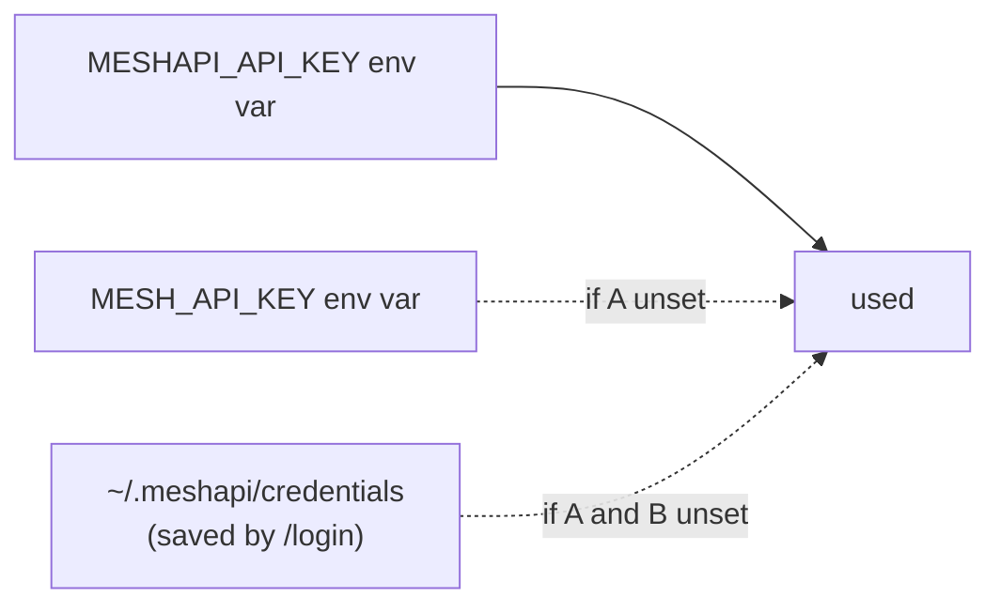

# `meshapi-code` and Claude Code

Two genuinely different things share the word "MeshAPI + coding tool," and it's easy to conflate
them. This doc covers both, verified by actually installing/inspecting the real package rather than
just reading docs.



- **`meshapi-code`** is MeshAPI's *own* competing terminal coding agent — install it, run `meshapi`,
  and it behaves like a self-contained Claude-Code-alike, just powered by whatever model you pick
  through the MeshAPI gateway instead of Claude specifically.
- **MCP** is the opposite direction: it lets *Claude Code itself* (the tool you're using right now)
  call MeshAPI as one tool among others in a normal Claude Code session — no separate app.

You can use either, both, or neither — they don't depend on each other.

---

## Part 1 — `meshapi-code`, the standalone CLI

### Install

You mentioned `uv pip install meshapi-code` — that works, but it installs into whichever virtual
environment is active at the time, so the `meshapi` command only exists when that venv is active.
For a CLI tool you want available everywhere (any folder, any terminal), the better fit is:

```bash
uv tool install meshapi-code
```

Verified live — installs cleanly, pulls in 13 small dependencies (`rich`, `prompt-toolkit`, `httpx`,
etc.), and exposes one command: **`meshapi`** (not `meshapi-code` — that's just the package name).

```
Installed 1 executable: meshapi
```

If `uv` warns that its tool bin directory isn't on your `PATH` yet, run `uv tool update-shell` once
and restart your terminal.

**Gotcha hit while testing this on Windows:** `uv tool update-shell` writes the PATH change
permanently, but any `cmd.exe` window that was *already open* keeps its old environment snapshot —
`meshapi --version` will still say `'meshapi' is not recognized` until you open a **brand new**
window. Fastest fix without restarting: `set PATH=%USERPROFILE%\.local\bin;%PATH%` in the current
window. Also, `meshapi` is invoked directly, not through `uv` — `uv meshapi --version` is wrong
(`uv` doesn't know a `meshapi` subcommand); just run `meshapi --version`.

### First run, step by step (Windows `cmd.exe`)

```cmd
cd /d D:\meshapi
set MESH_API_KEY=rsk_your_key_here
meshapi
```

That drops you into an interactive chat. Type a question or instruction and hit enter — e.g.
`explain what app/rag.py does`. `set MESH_API_KEY=...` only lasts for that terminal session; run
`/login` once inside `meshapi` instead if you want the key remembered permanently (see
Authentication above).

### Authentication

Checked the installed source directly (`meshapi/config.py`) rather than guessing. Key resolution
order, first match wins:



- **It does not read `.env` files itself.** Your project's `.env` (with `MESH_API_KEY=...`) won't be
  picked up automatically — `.env` only gets loaded by Python processes that explicitly call
  `load_dotenv()`, and this CLI doesn't. Either export the key in your shell first
  (`export MESH_API_KEY=rsk_...`), or just run `meshapi` and use `/login` once — it saves the key to
  `~/.meshapi/credentials`, created with `0600` permissions (owner-read-only), separate from the
  regular `~/.meshapi/config.json` settings file so a config it prints/shares never leaks the key.
- It refuses non-HTTPS `base_url` values outright (except `localhost`, for local dev/proxy setups) —
  a deliberate guard against sending your key in cleartext.

### Command reference (verified — this is the real `/help` output)

```
/exit                      end session
/clear                     reset conversation
/model <name>              switch model (e.g. anthropic/claude-sonnet-4.5)
/models [free|<query>]     browse the catalog (context, $/1M pricing)
/route auto|off|preview    auto-route each prompt to the best model
/fallback <m1> <m2> | off  ordered fallback models if the primary fails
/reasoning <level>         high|medium|low|none|off reasoning effort
/mode <perm>               default|accept-edits|auto|bypass  (or shift+tab)
/file <path>               add text file to context
/image <path|url>          attach an image (base64) to the next prompt
/clear-attach              drop any queued image attachments
/system <txt>              set system prompt
/cost                      show session spend
/optimize <dial>           token savings, beta: 0 off, up to 0.95
/memory [notes|clear|on|off]  repo memory: map + notes from past sessions
/login                     set or replace your API key
/update                    check PyPI for a newer meshapi
/help                      show this
```

Also available as CLI flags at launch, so you don't need to set them every session:

```bash
meshapi --model openai/gpt-4o-mini --route auto --mode accept-edits
```

### Changing models

Three ways, pick whichever fits:

1. **Mid-session, know the name:**
   ```
   /model openai/gpt-4o-mini
   /model anthropic/claude-sonnet-4.5
   /model mistral/mistral-large-3-675b-instruct
   ```
   Takes effect immediately — your next message goes to the new model.

2. **Mid-session, don't know the exact name:** browse first, then switch.
   ```
   /models
   /models claude
   /models free
   ```
   Lists id, context length, and $/1M token pricing. `/models free` shows only the free-tier models
   (handy for testing without spending anything). Copy the `id` you want into `/model <id>`.

3. **At launch**, so you don't need the in-session step at all:
   ```cmd
   meshapi --model openai/gpt-4o-mini
   ```

**Don't want to pick manually?** `/route auto` (or `--route auto` at launch) hands model selection
to MeshAPI's own router — it picks a model per-prompt based on what you're asking, no fixed model at
all. `/route off` goes back to a fixed model; `/route preview` shows what the router *would* pick
without committing to it.

### Permission modes

Cycle with **Shift+Tab** during a session, or set with `/mode` / `--mode`:

| Mode | Behavior |
|---|---|
| `default` | Asks before every file write, command, or search |
| `accept-edits` | File writes in your project auto-approved; commands/searches still ask |
| `auto` | File writes, commands, and web searches all run without asking |
| `bypass` | Everything auto-approved (genuinely dangerous actions still confirm) |

### When to reach for it

Good for a quick "just chat with a model" or "let an agent poke at this repo" session from a
terminal, using whichever of MeshAPI's 997 models you want, without opening an IDE. It's a separate
product from this repo's notebooks/apps — nothing here depends on it.

---

## Part 2 — MeshAPI as an MCP tool inside Claude Code

MCP (Model Context Protocol) is how tools like Claude Code call out to external services as part of
a normal conversation. MeshAPI runs an MCP server at `https://api.meshapi.ai/mcp` — add it once, and
any Claude Code session on your machine can call MeshAPI's gateway as a tool, without you writing any
integration code.

### Setup

```bash
claude mcp add --transport http mesh-api https://api.meshapi.ai/mcp \
  --header "Authorization: Bearer rsk_YOUR_KEY"
```

Or, equivalently, as a JSON MCP config block (useful if you manage config files directly, e.g. a
project-level `.mcp.json`):

```json
{
  "mcpServers": {
    "mesh-api": {
      "type": "http",
      "url": "https://api.meshapi.ai/mcp",
      "headers": { "Authorization": "Bearer rsk_YOUR_KEY" }
    }
  }
}
```

*(This section is per MeshAPI's official docs, fetched earlier this session — not re-verified live
today, since the `claude` CLI binary isn't available in this sandboxed environment to test the actual
`mcp add` command. The JSON shape follows the standard MCP HTTP-transport format either way.)*

### What it gives Claude Code access to

Once added, these become tools Claude Code can call mid-conversation — e.g. you could just ask
"what's my MeshAPI balance?" or "generate an image of X with MeshAPI" and it uses the MCP tool
directly instead of you writing a script:

```
chat, responses, embeddings, moderations, compare, router_select,
generate_image, edit_image, web_search, file_search, upload_file,
list_files, get_file, list_models, list_voices, get_balance,
list_templates, get_template, create_template, update_template, delete_template
```

Notably **not** exposed over MCP: audio (TTS/STT), video generation, batch jobs, realtime audio —
those still need direct API/SDK calls, like everywhere else in this repo.

### When to reach for it

If you're already working in Claude Code on this (or any) project and want to ask it to check your
MeshAPI balance, list models, or run a quick comparison without leaving the chat — this is the
lowest-friction option, no separate terminal, no code.

---

## Quick decision table

| You want to... | Use |
|---|---|
| Chat with any MeshAPI model from a bare terminal, have it edit files | `meshapi-code` CLI |
| Ask Claude Code (this tool) to check MeshAPI balance / models / run a quick call mid-conversation | MCP server |
| Build a real app (RAG, agents, a UI) | The SDK directly — see `app/`, `native_rag_app/`, and the notebooks in this repo |

## Env keys

Both need the same kind of credential — an `rsk_...` key from the MeshAPI dashboard:

| Tool | How it gets the key |
|---|---|
| `meshapi-code` CLI | `MESHAPI_API_KEY` or `MESH_API_KEY` env var, or `/login` (saved to `~/.meshapi/credentials`) |
| MCP server | Passed once in the `claude mcp add` command / JSON config as a header, not an env var |

The same key you already have in this repo's `.env` (`MESH_API_KEY`) works for both — MeshAPI keys
aren't scoped to a specific SDK or tool.
